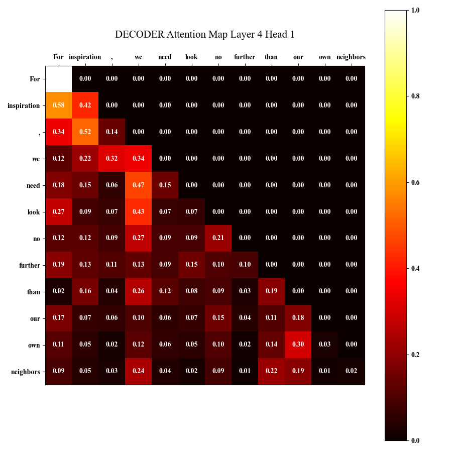

## This Repo is for CSE 256 LIGN 256 - Statistical Natural Lang Proc - Nakashole [FA24] PA1
### Author: [Zhecheng Li](https://github.com/Lizhecheng02) && Professor: [Ndapa Nakashole](https://ndapa.us/)

### Python Environment

#### 1. Install Packages

```b
pip install -r requirements.txt
```

### Prepare Data
All datasets are already in the GitHub repo.

### Run Codes
##### 1. Encoder
- If you want to train the encoder classification with ``traditional attention`` and ``mean embedding output``, use:

  ```bas
  python main.py --run "encoder_classic_mean"
  ```

- If you want to train the encoder classification with ``slide window attention`` and ``mean embedding output``, use:

  ```bas
  python main.py --run "encoder_window_attention"
  ```
  
- If you want to train the encoder classification with ``alibi relative positional embedding`` and ``mean embedding output``, use:

  ```ba
  python main.py --run "encoder_alibi"
  ```
  
- If you want to train the encoder classification with ``disentangled attention patterns`` in DeBERTa model and ``mean embedding output``, use:

  ```bas
  python main.py --run "encoder_deberta"
  ```
  
- If you want to train the encoder classification with extra <cls> token to represent the final embedding output rather than using mean embedding output, use:

  ```bas
  python main.py --run "encoder_cls_token"
  ```


You can change the parameters in ``main.py``, but you should be able to get around 86-87% accuracy using default values.

<div style="text-align: center;">
    
</div>

The code will draw attention plots after training for one specific sentence, they are saved under ``attention_maps`` folder. Here is an example:

<div style="text-align: center;">
    
</div>
##### 2. Decoder

- If you want to train the traditional decoder-only model for text generation, use:

  ```bas
  python main.py --run "decoder"
  ```

You can also change the parameters in ``main.py``, but you should be able to get around 6.5 loss using default values.

<div style="text-align: center;">
    
</div>

The code will also draw attention plots after training for one specific sentence, they are also saved under ``attention_maps`` folder. We can see the difference caused by attention mask. Here is an example:

<div style="text-align: center;">
    
</div>
